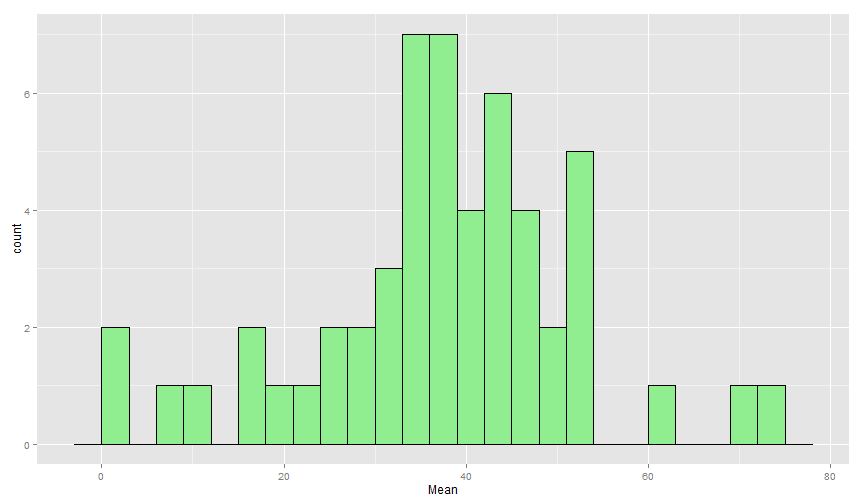
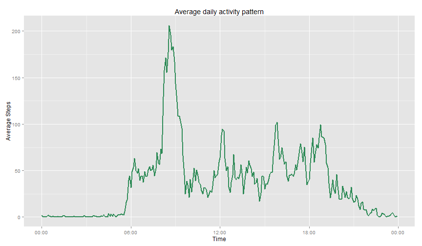
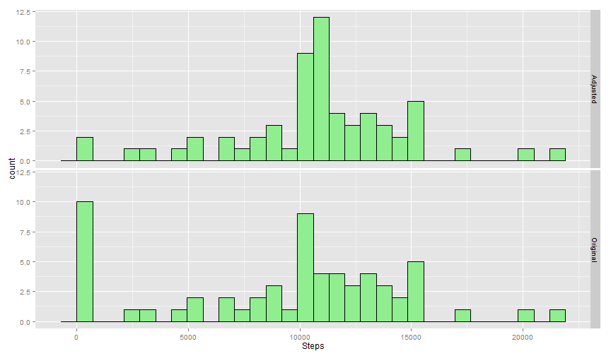
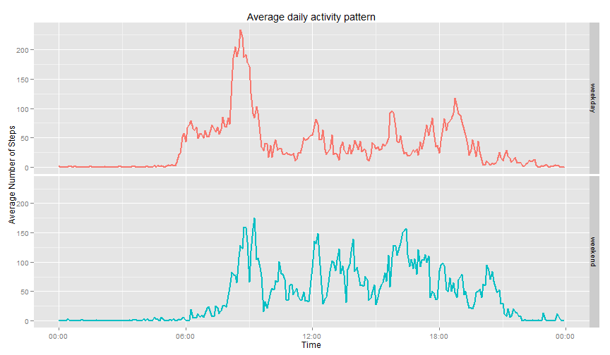

Reproducible Research - Peer Assessment 1
========
Author: "Vishnu Chevli"
--------
Date: "Thursday, August 07, 2014"
- - -

### Part 0 : Data preparation

Setting global options before we start working on project

```r
opts_chunk$set(eacho = TRUE, warning = FALSE, fig.width=12)
```


Following code reads data from *acticity.csv* file
It convert reading to data.table for better processing


```r
library(data.table)
reading = read.csv('activity.csv', header= TRUE, stringsAsFactors = FALSE)
reading = data.table(reading)
```

Following set of code convert data into required format:
 1. It converts date from character to POSIXct date 
 2. It matches interval with appropriate minute interval 
 3. Once we have date and time we are calculating timestamp 
 4. After 3rd step we are sorting data using timestamp
 5. Finally we are rearranging columns of data


```r
reading$date = as.POSIXct(reading$date,format = '%Y-%m-%d')

#Creating dummy data to match interval against time
dummy.frame = data.table(interval = unique(reading$interval), 
                         time = rep(as.ITime('00:00:00',format='%H:%M:%S'),288) + 
                           (0:287)*5*60)
reading = merge(reading,dummy.frame, by = 'interval')
rm(dummy.frame) #Removing as not required now

#Creating, sorting and reording using timestamp
reading$timestamp = reading$date + reading$time
reading = reading[order(timestamp),]
setcolorder(reading, c('date', 'time', 'timestamp', 'steps', 'interval'))
```

- - -

### Part 1: What is mean total number of steps taken per day?

Following code will summarize reading table and calculate following:
 1. Total steps taken per day
 2. Mean of steps taken per day
 3. Median of steps taken per day

```r
summaryByDate = reading[,list(TotalSteps = as.numeric(sum(steps,na.rm = TRUE)),
                             Mean = as.numeric(mean(steps, na.rm = TRUE)),
                             Median = as.numeric(median(steps, na.rm = TRUE))), by = date]
```

#### Question 1. Make a histogram of the total number of steps taken each day
Following code will display historian of total steps taken per day

```r
library(ggplot2)
library(scales)
ggplot(data = summaryByDate) + 
  geom_histogram(aes(x = Mean), binwidth = 3, color = 'black', fill = 'light green')
```

 

#### Question 2. Calculate and report the mean and median total number of steps taken per day
Following code will display mean and median of total steps taken per day

```r
#Printing summary table
summaryByDate
```

```
##           date TotalSteps    Mean Median
##  1: 2012-10-01          0     NaN     NA
##  2: 2012-10-02        126  0.4375      0
##  3: 2012-10-03      11352 39.4167      0
##  4: 2012-10-04      12116 42.0694      0
##  5: 2012-10-05      13294 46.1597      0
##  6: 2012-10-06      15420 53.5417      0
##  7: 2012-10-07      11015 38.2465      0
##  8: 2012-10-08          0     NaN     NA
##  9: 2012-10-09      12811 44.4826      0
## 10: 2012-10-10       9900 34.3750      0
## 11: 2012-10-11      10304 35.7778      0
## 12: 2012-10-12      17382 60.3542      0
## 13: 2012-10-13      12426 43.1458      0
## 14: 2012-10-14      15098 52.4236      0
## 15: 2012-10-15      10139 35.2049      0
## 16: 2012-10-16      15084 52.3750      0
## 17: 2012-10-17      13452 46.7083      0
## 18: 2012-10-18      10056 34.9167      0
## 19: 2012-10-19      11829 41.0729      0
## 20: 2012-10-20      10395 36.0938      0
## 21: 2012-10-21       8821 30.6285      0
## 22: 2012-10-22      13460 46.7361      0
## 23: 2012-10-23       8918 30.9653      0
## 24: 2012-10-24       8355 29.0104      0
## 25: 2012-10-25       2492  8.6528      0
## 26: 2012-10-26       6778 23.5347      0
## 27: 2012-10-27      10119 35.1354      0
## 28: 2012-10-28      11458 39.7847      0
## 29: 2012-10-29       5018 17.4236      0
## 30: 2012-10-30       9819 34.0938      0
## 31: 2012-10-31      15414 53.5208      0
## 32: 2012-11-01          0     NaN     NA
## 33: 2012-11-02      10600 36.8056      0
## 34: 2012-11-03      10571 36.7049      0
## 35: 2012-11-04          0     NaN     NA
## 36: 2012-11-05      10439 36.2465      0
## 37: 2012-11-06       8334 28.9375      0
## 38: 2012-11-07      12883 44.7326      0
## 39: 2012-11-08       3219 11.1771      0
## 40: 2012-11-09          0     NaN     NA
## 41: 2012-11-10          0     NaN     NA
## 42: 2012-11-11      12608 43.7778      0
## 43: 2012-11-12      10765 37.3785      0
## 44: 2012-11-13       7336 25.4722      0
## 45: 2012-11-14          0     NaN     NA
## 46: 2012-11-15         41  0.1424      0
## 47: 2012-11-16       5441 18.8924      0
## 48: 2012-11-17      14339 49.7882      0
## 49: 2012-11-18      15110 52.4653      0
## 50: 2012-11-19       8841 30.6979      0
## 51: 2012-11-20       4472 15.5278      0
## 52: 2012-11-21      12787 44.3993      0
## 53: 2012-11-22      20427 70.9271      0
## 54: 2012-11-23      21194 73.5903      0
## 55: 2012-11-24      14478 50.2708      0
## 56: 2012-11-25      11834 41.0903      0
## 57: 2012-11-26      11162 38.7569      0
## 58: 2012-11-27      13646 47.3819      0
## 59: 2012-11-28      10183 35.3576      0
## 60: 2012-11-29       7047 24.4688      0
## 61: 2012-11-30          0     NaN     NA
##           date TotalSteps    Mean Median
```

- - - 

### Part 2: What is the average daily activity pattern?

#### Question 1. Make a time series plot of the 5-minute interval against the average number of steps taken, averaged across all days

Following code will find out average activity and display Timeseries graph for daily activity


```r
summaryByTime = reading[,list(Mean = as.numeric(mean(steps, na.rm = TRUE))), by = time]

#Finding Member having maximum avergae number of step
maxSteps = summaryByTime[Mean == max(summaryByTime$Mean),]

#Converting to POSIXct Time for ggplot use
summaryByTime$time = as.POSIXct(summaryByTime$time)

ggplot(summaryByTime) + geom_line(aes(x=time,y=Mean), size = 1, color = 'sea green') +
  labs(x = 'Time', y = 'Average Steps', title = 'Average daily activity pattern') +
  scale_x_datetime(labels = date_format("%H:%M"))
```

 

#### Question 2. Which 5-minute interval, on average across all the days in the dataset, contains the maximum number of steps?
At **08:35:00** time maximum number of steps = **206**

- - -

### Part 3: Imputing missing values
#### Question 1. Calculate and report the total number of missing values in the dataset
Following code will find out number of missing values for all variables and will display it in tabular manner

```r
NACounts = data.frame(NA_Count = apply(reading,2,function(x){sum(is.na(x))}))
NACounts
```

```
##           NA_Count
## date             0
## time             0
## timestamp        0
## steps         2304
## interval         0
```

#### Question 2. A strategy for filling in all of the missing values in the dataset.
Here for imputation we are assigning mean value for that time period accross all days to that time period.
For example on 1st Oct 2012 at 00:00 there is not entry for step, 
this would be replaced by mean of steps taken at 00:00 min

#### Question 3. Create a new dataset that is equal to the original dataset but with the missing data filled in.
Following code will create a new dataset readingAdj with steps adjusted as new columns AdjSteps.

```r
#Finding daily summary
summaryByTime = reading[,list(Mean = as.numeric(mean(steps, na.rm = TRUE))), by = time] 

#Adding time based mean column
readingAdj = merge(reading, summaryByTime, by = 'time')

#If steps value missing adjusting to mean of that time
readingAdj$AdjSteps = ifelse(is.na(readingAdj$steps), readingAdj$Mean, readingAdj$steps)

#Removing Mean column
readingAdj$Mean = NULL

#Sorting and reordining of columns
readingAdj = readingAdj[order(timestamp),]
setcolorder(readingAdj, c('date', 'time', 'timestamp', 'steps', 'interval', 'AdjSteps'))
```

#### Question 4. Comparision of adjusted dataset with original.
Following set of code will find out total steps taken in normal case and after adjustments
We are plotting both histograms side-by-side to make difference visible

```r
#Finding summary of steps after and before adjustment
adjSummaryByDate = readingAdj[,list(TotalSteps = as.numeric(sum(steps,na.rm = TRUE)),
                                    Mean = as.numeric(mean(steps, na.rm = TRUE)),
                                    Median = as.numeric(median(steps, na.rm = TRUE)),
                                    TotalStepsAdj = as.numeric(sum(AdjSteps,na.rm = TRUE)),
                                    MeanAdj = as.numeric(mean(AdjSteps, na.rm = TRUE)),
                                    MedianAdj = as.numeric(median(AdjSteps, na.rm = TRUE))), by = date]

#Preparing a new variable for histogram
forGraph = data.table(TypeData = c(rep(c('Original','Adjusted'),each = nrow(adjSummaryByDate))),
                      Steps = c(adjSummaryByDate$TotalSteps, adjSummaryByDate$TotalStepsAdj))
ggplot(data = forGraph) + facet_grid(TypeData~.) +
  geom_histogram(aes(x = Steps), color = 'black', fill = 'light green')
```

```
## stat_bin: binwidth defaulted to range/30. Use 'binwidth = x' to adjust this.
## stat_bin: binwidth defaulted to range/30. Use 'binwidth = x' to adjust this.
```

 

Following code will print mean, median, standard deviation of steps in both scenario

```r
readingAdj[,list(Mean_Without_Adj = mean(steps, na.rm=TRUE), Mean_With_Adj = mean(AdjSteps),
                 Median_Without_Adj = median(steps, na.rm=TRUE), Median_With_Adj = median(AdjSteps),
                 Std_Dev_Without_Adj = sd(steps, na.rm=TRUE), Std_Dev_With_Adj = sd(AdjSteps))]
```

```
##    Mean_Without_Adj Mean_With_Adj Median_Without_Adj Median_With_Adj
## 1:            37.38         37.38                  0               0
##    Std_Dev_Without_Adj Std_Dev_With_Adj
## 1:                 112            105.3
```
From above table and histogram, we can see that imputing missing value changes behavior of the data.

Total number of steps taken in earlier case were **570608**  
Total number of steps taken in after adjustment were **6.5674 &times; 10<sup>5</sup>**
- - -

### Part 4: Are there differences in activity patterns between weekdays and weekends?
#### Question 1. Create a new factor variable in the dataset with two levels indicating whether a given date is a weekday or weekend day.
Following code will create factor from date

```r
weekday = c("Monday", "Tuesday", "Wednesday", "Thursday", "Friday")
#Finding weekday or weekend
reading$Day = ifelse(weekdays(reading$date) %in% weekday, 'weekday', 'weekend')
rm(weekday)

reading$Day = as.factor(reading$Day)
```

#### Question 2. Make a panel plot containing a time series plot of the 5-minute interval against the average number of steps taken, averaged across all weekday days or weekend days.
Following code will generate average activity across weekend and weekday seperatly and then plot it.

```r
summaryByTimeByDay = reading[,list(Mean = as.numeric(mean(steps, na.rm = TRUE))),
                        by = list(Day,time)]

#Converting to POSIXct Time for ggplot use
summaryByTimeByDay$time = as.POSIXct(summaryByTimeByDay$time)

ggplot(summaryByTimeByDay) + geom_line(aes(x=time,y=Mean, color = Day), size = 1) + facet_grid(Day~.) +
  labs(x = 'Time', y = 'Average Number of Steps', title = 'Average daily activity pattern') +
  scale_x_datetime(labels = date_format("%H:%M")) + theme(legend.position="none")
```

 
